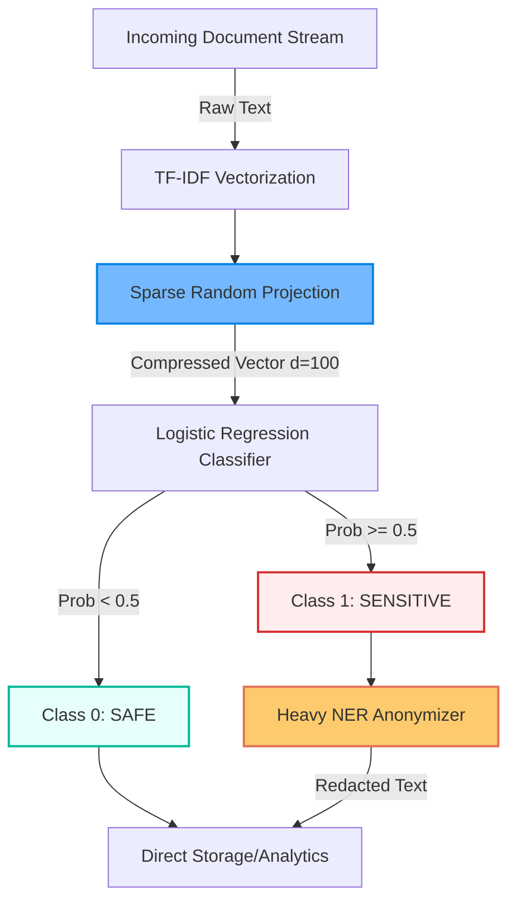

# PII-privacy-redaction-pipeline

```mermaid
graph TD
    A[Incoming Document Stream] -->|Raw Text| B[TF-IDF Vectorization]
    B --> C[Sparse Random Projection]
    C -->|Compressed Vector d=100| D[Logistic Regression Classifier]
    
    D -->|Prob < 0.5| E[Class 0: SAFE]
    D -->|Prob >= 0.5| F[Class 1: SENSITIVE]
    
    E --> G[Direct Storage/Analytics]
    F --> H[Heavy NER Anonymizer]
    H -->|Redacted Text| G
    
    style E fill:#e6fffa,stroke:#00b894,stroke-width:2px
    style F fill:#ffecec,stroke:#d63031,stroke-width:2px
    style H fill:#fdcb6e,stroke:#e17055,stroke-width:2px
    style C fill:#74b9ff,stroke:#0984e3,stroke-width:2px
```
