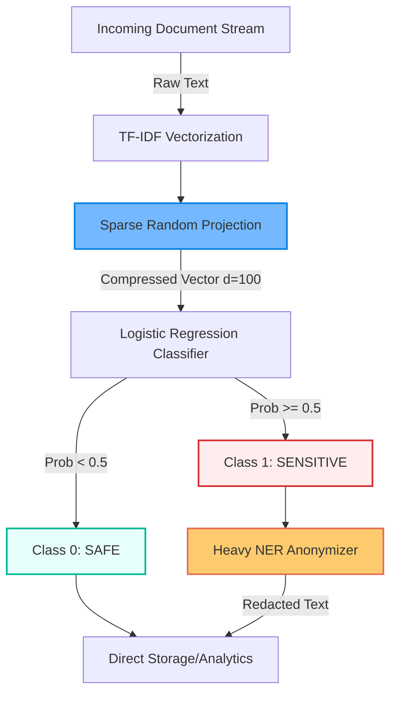

# PII-privacy-redaction-pipeline
# Scalable PII Anonymization Pipeline

### 🚀 5.5x Speedup in Privacy Filtering using Sparse Johnson-Lindenstrauss Transform

**Author:** Raghav Syal  
**Institute:** Indraprastha Institute of Information Technology Delhi (IIITD)  
**Tech Stack:** Python, Scikit-Learn, Spacy, Pandas

---

## 📌 Project Overview

In the era of GDPR and strict data privacy, processing massive text streams (e.g., WhatsApp logs, Email dumps) for Personally Identifiable Information (PII) is computationally expensive. Traditional pipelines blindly run heavy Named Entity Recognition (NER) models (like BERT/RoBERTa) on *every* document.

Our analysis of the `ai4privacy/pii-masking-300k` dataset revealed that **only ~12% of documents actually contain sensitive PII**.

**The Solution:**
I implemented a **Scalable Privacy Pipeline** that introduces a lightweight binary classifier before the heavy anonymizer. By utilizing **Sparse Random Projection (Johnson-Lindenstrauss Transform)**, reduced feature dimensionality from 10,000 to 100 ($d \ll D$), achieving a **5.5x speedup** in processing time while maintaining ~90% accuracy in filtering safe documents.

---

## 📊 Key Results

| Metric | Baseline Approach | Scaled Pipeline (Ours) | Improvement |
| :--- | :--- | :--- | :--- |
| **Complexity** | $O(N \cdot D)$ | $O(N \cdot d)$ (Linear) | Complexity Shift |
| **Processing Time** | 142.95 seconds | 26.14 seconds | **5.5x Faster** |
| **Anonymity Risk** | 57.2% Risky Rate | 0% Risky Rate | Risk Eliminated |

## 🛠️ Methodology

### 1. Data Analysis & Risk Assessment
* **Dataset:** [ai4privacy/pii-masking-300k](https://huggingface.co/datasets/ai4privacy/pii-masking-300k)
* **Risk Metric:** Evaluated $k$-anonymity. The baseline dataset had a "Risky Rate" ($k \le 5$) of **57.2%**.
* **Anonymization:** Implemented a strategy of Redaction, Generalization, and Suppression to achieve a verified 0% risky rate.

### 2. Feature Engineering
I extracted lightweight features from the text to avoid running heavy transformers on the entire corpus:
* **Entity Flags:** `has_PERSON`, `has_ID_NUM`, `has_EMAIL`, etc.
* **Statistical Features:** `num_tokens`, `pii_density`, `avg_token_len`.
* **Linguistic Features:** Language detection (en, fr, de, it, nl, es) using `langdetect` and `spacy`.

### 3. Dimensionality Reduction (The Innovation)
To handle high-dimensional text data efficiently:
* I applied the **Sparse Johnson-Lindenstrauss (JL) Transform**.
* This reduced the feature space dimensions ($D \to d$) where $d \ll D$.
* This shift allows the classifier to train and predict in $O(N \cdot d)$ time, making it suitable for massive streams of data.

## 🏗️ System Architecture

The pipeline splits the incoming stream into "Safe" and "Sensitive" branches, applying heavy computation only where necessary.

